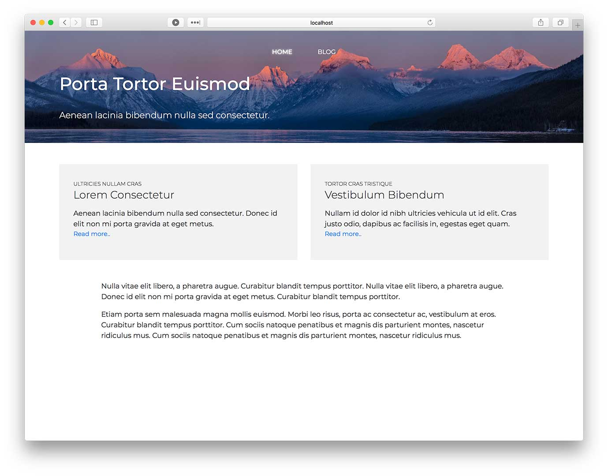
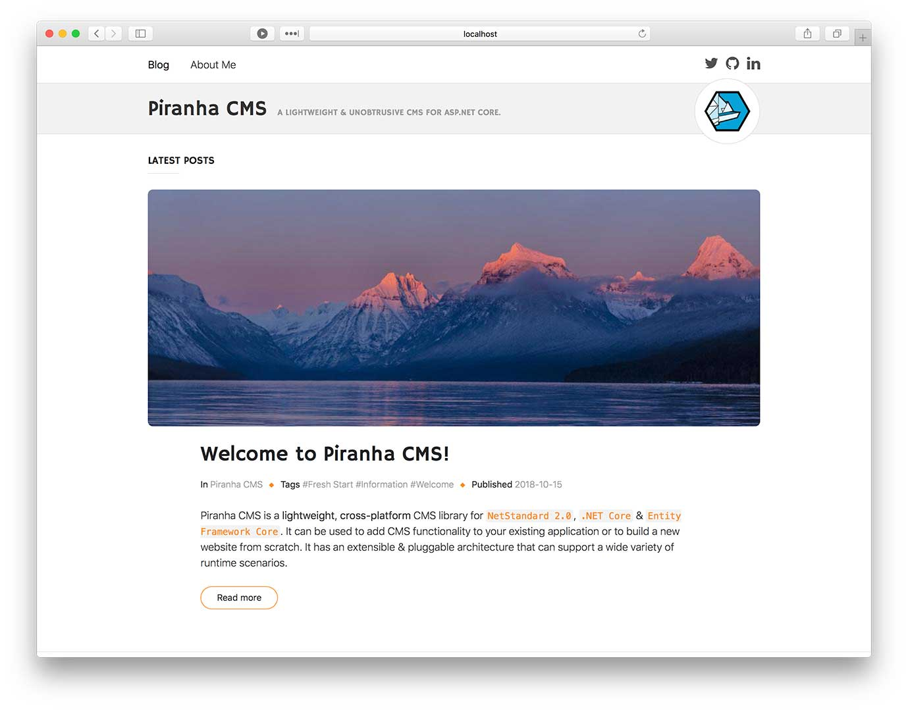

# Project Templates

If you want to get started quickly the easiest way to get going is to use one of the **Templates** available. The templates are used to create a **new project** from scratch and not to add CMS functionality to an existing application.

If you want to add Piranha into an application, it's still a good start to create a new project from one of the templates and examine what happens in the `Startup.cs`.

## Installing the Templates

Project Templates for .NET Core are installed from the **CLI** using the `dotnet new` command. If you're updating an already installed template, make sure you specify the version you want to install.

~~~ bash
> dotnet new -i Piranha.Templates
~~~

## Web Template

The Web Template includes **models**, **controllers** and **views** for:

* Startpage with a **Hero**, **Teaser Section** and **Block based content**.
* Blog Archive with a **Hero** and **Post listing**.
* Basic Page with **Block based content**.
* Basic Post with a **Primary Image** and **Block based content**.

### How To Use

When creating a new project with `dotnet new` you should first create a new empty folder. The default behaviour is that the new project is **named after its containing folder**. Please note that naming your project `Piranha` (even if it is a test project) will result in a circular reference error when you try to restore the packages.

~~~ bash
> dotnet new piranha.web
> dotnet restore
> dotnet run
~~~

## Blog Template

The Blog Template includes **models**, **controllers** and **views** for:

* Blog Archive with **paging**, **category** & **tag filtering**.
* Blog Post with a **Primary Image**, **Ingress** & **Block based content**.
* Basic Page with **Block based content**.

### How To Use

When creating a new project with `dotnet new` you should first create a new empty folder. The default behaviour is that the new project is **named after its containing folder**. Please note that naming your project `Piranha` (even if it is a test project) will result in a circular reference error when you try to restore the packages.

~~~ bash
> dotnet new piranha.blog
> dotnet restore
> dotnet run
~~~

**The blog template is also available for Razor Pages.**

~~~ bash
> dotnet new piranha.blog.razor
> dotnet restore
> dotnet run
~~~